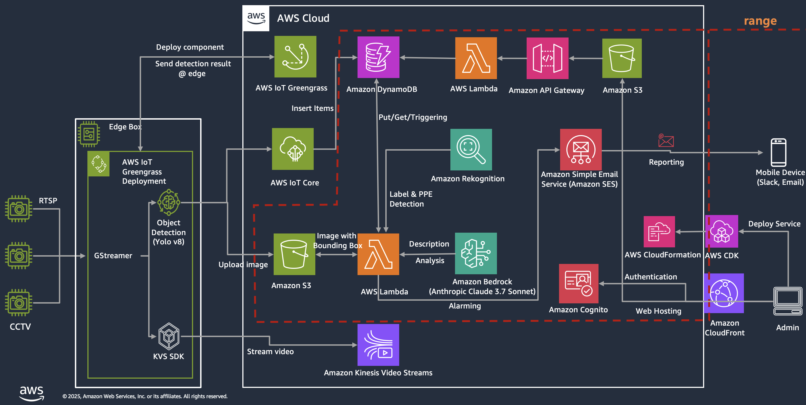

# Generative AI CCTV 안전상황판


## 생성형AI를 활용한 CCTV 안전감지 및 스키장 대기 예상 시간 분석 서비스

해당 프로젝트는 Amazon Bedrock, Rekognition 등을 활용하여 CCTV에서 송출된 이미지 프레임을 분석하여 위험, 정상인 상황을 분석합니다. 또한 위험 상황에서는 1에서 10까지의 척도를 기준으로 심각도를 함께 표시를 합니다. 
특히 스키장 리프트 대기 CCTV의 이미지가 입력된 경우에는 예상 대기 시간을 함께 분석결과에 보여주는 데모 입니다. 

참고로 지난 AWS re:Invent 2023와 Hannover Messe 2024에서 시연되었던 프로젝트를 기반으로 용도에 맞춰 커스터마이징 하였습니다. 



AWS CDK를 기반으로 환경을 구성할 수 있으며 본 프로젝트에서는 AWS IOT 서비스 범위는 제외한 실제 이미지를 처리하는 부분에 대해서만 구현하였습니다.


## 설치방법

### 사전 요구 사항

- IDE 환경에 AWD CDK를 설치가 필요하며 스토리지는 약 20GB 정도의 여유분이 있어야 합니다. - https://docs.aws.amazon.com/cdk/v2/guide/getting_started.html
- us-west-2 기준으로 Amazon Bedrock 모델 중 Anthropic Cluade 3.7 Sonnet 모델에 대한 활성화가 필요합니다. - https://docs.aws.amazon.com/bedrock/latest/userguide/model-access.html


### 배포
1. 해당 레포지터리를 클론하고 클론된 레포지터리의 루트로 이동합니다. 
2. 아래의 명령어를 실행하여 CDK Stack을 배포합니다.

```
$ npm ci
$ npm run cdk:deploy
```

배포시에는 CloudFormation 스택이 생성이 되며 아래의 주요 리소스도 함께 생성이 됩니다. 
- S3 bucket: genaicctvstack-backendedgeimagesbucketXXXX <- JPG/JPEG/PNG 등의 이미지 업로드 버킷
- CloudFront URl: https://YYYY.cloudfront.net <- 로그인 페이지 및 대시보드 접속 주소
- DynamoDB: GenAICCTVStack-BackendClassifications <- Claude 3.7 Sonnet 에서 생성된 이미지 캡션, Rekognition에서 분석된 PPE, Label, 위험/정상, 위험도 정보가 저장됨


### 주요 코드 설명
- cdk/bin/lambda-backend/index.py 에 Bedrock model에 질의하는 prompt 및 분석 설정 부분이 있으며 참고 및 수정하시면 됩니다.
- UI 관련한 부분은 ui/components/ui 내의 페이지를 수정하시면 됩니다. 
- 해당 프로젝트는 비운영환경에서 배포하는 용도로 PoC에 목적이 있습니다.


### 대시보드 웹 접근 방법
1. CloudFront URL로 접근하여 회원가입하기, Email 입력 후, 인증코드 입력하여 본인인증하면 가입하기 <- Amazon Cognito 사용자풀, 사용자에서 멤버 확인 가능
2. AWS Management Console - S3 Bucket에 CCTV 화면을 직접 Upload 하고 약 5초 정도 대기
3. 분석된 이미지가 대시보드에 객체가 선택된 바운딩 박스와 함께 표시되며 위험도, 대기시간 등이 표시됩니다.

### 문제 해결
- 만일 설치하는 과정에서 CDK 관련 버전 에러가 발생할 수 있습니다. NCU 업그레이드 및 aws-cdk, cdk를 삭제 및 재설치 하시면 됩니다. 
```
$ npm install -g npm-check-updates
$ ncu -u
$ npm uninstall aws-cdk
$ npm uninstall cdk
$ npm install aws-cdk cdk --force

```

### 참고 프로젝트
- https://github.com/aws-samples/generative-ai-camera-demo?tab=readme-ov-file


